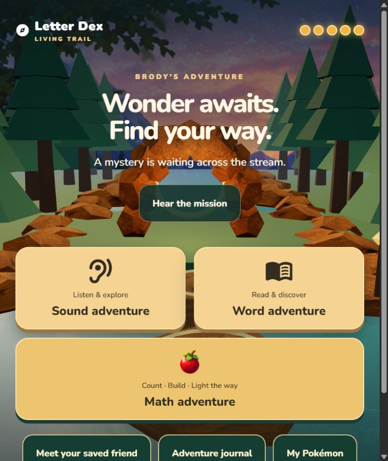
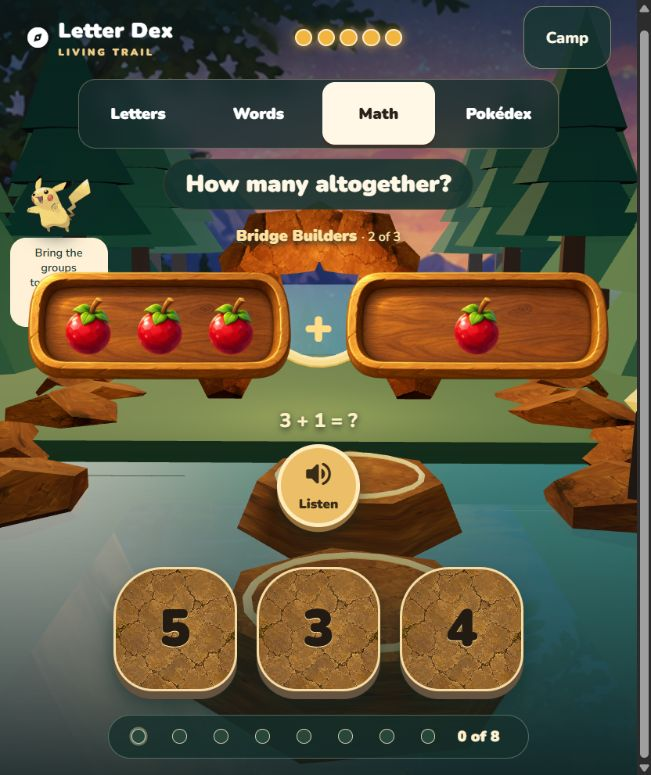

# Pilot engagement review — 5 September 2026

Scope: current camp-to-math entry, captured on the laptop during the adult-led
pilot. Goal: identify why the selected adventure feels too easy and insufficiently
Pokémon-focused. This is a bounded two-screen review, not a full game audit.

Adult report: "He spotted them right away, the repetition was easy. There is not
enough challenge and not enough Pokemon included". This supports an engagement
and challenge-fit problem. It does not establish mastery across all quantities.

## 1. Camp — understandable entry, weak Pokémon invitation

The three large choices separate sound, word, and math play clearly. Math promises
counting, building, and lighting the way, but this captured entry contains no
visible Pokémon character or specific Pokémon-related purpose. Collection and
the saved encounter are separate controls lower on the page.

Recommendation: make an existing Pokémon encounter or companion's purpose
visible before the first question. Keep the selected destinations and runtime
PokéAPI artwork; no new world or curriculum is required by this recommendation.

## 2. Bridge Builders entry — readable math, weak connection to the companion

The existing next stage presents two berry groups and `3 + 1 = ?` with large
number choices, an obvious Listen button, and eight quest indicators. A small
Pikachu appears on the left. The berry tray overlaps its instruction bubble in
this captured viewport, obscuring part of the explanation.

Recommendations:

- Compare a few existing addition or missing-amount questions before deciding
  whether the activity is challenging enough. This screenshot does not show
  the child's response to addition. Do not infer that addition within five will
  automatically solve the reported boredom.
- In a separately scoped correction, make the Pokémon visibly participate in
  the current task and its consequence, rather than relying only on its small
  sidebar appearance. Preserve fair retries and the eight-success reward rule.
- Fix the tray/bubble overlap and recheck compact layouts before relying on the
  companion's text to explain the purpose of the task.
- Consider an adult-controlled starting point among the three existing stages
  if the comparison confirms that counting is an unnecessary repetition. This
  is a proposal, not a change to existing progression or evidence rules.

## Limits and decision

The screenshots confirm the entry hierarchy, math arrangement, small companion,
and overlap. They cannot establish engagement duration, auditory clarity,
keyboard/screen-reader compliance, or physical tablet usability. No answer was
selected during this capture. Quest completion and end-of-quest Pokémon reveal
were not recaptured in this bounded audit.

Treat the current challenge fit as needing correction and retest. New curriculum,
new worlds, and AR/PW work remain frozen. Creative work should use these pilot
findings to improve the selected slice, without treating the visuals themselves
as validation that the game is more engaging.
